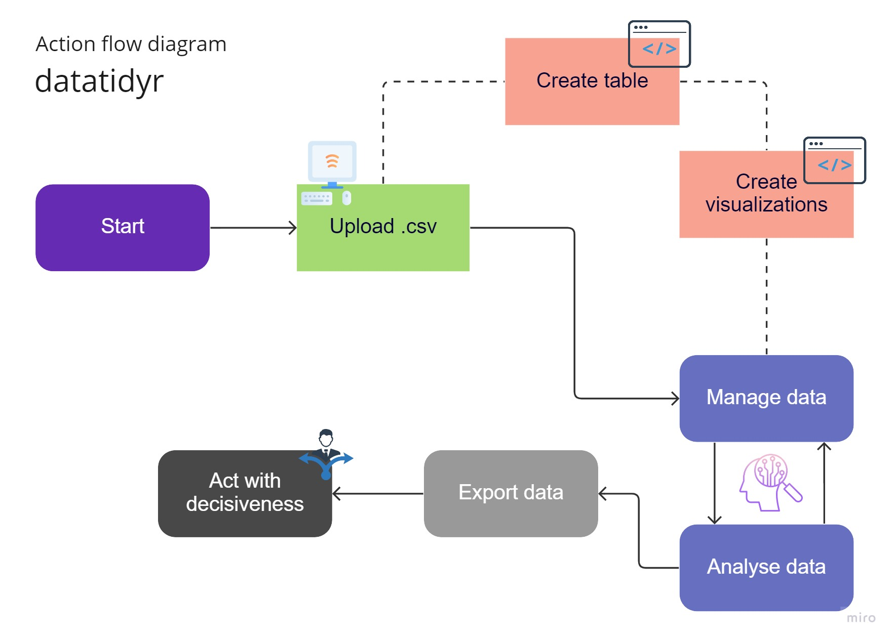

# datatidyr
Datatidyr is an open-source web application that provides users an easy, intuitive way to manage data. Buildt with a Flask backend in Python and React frontend in JavaScript, datatidyr utilizes the ReactDataGrid to power its data management feature. 

## | Getting Started
To get started with Datatidyr, follow these steps:

1. Clone the project from its [GitHub repository](https://github.com/birkeland007/datatidyr).
2. Install the project's requirements using the included [requirements.txt](backend/requirements.txt) and [package.json](frontend/package.json).
3. Run the backend with `python main.py` and the frontend with `npm start` from their respective directories.

## | Features
Datatidyr provides a range of features to help users manage their data effectively, including:

- An intuitive user interface
- Support for creating, editing, and deleting data entries
- Powerful filtering and sorting tools
- CSV export
  

## | Project
datatidyr is a personal project, used to advance my skills and feedback / contributions are therefore greatly appreciated.
